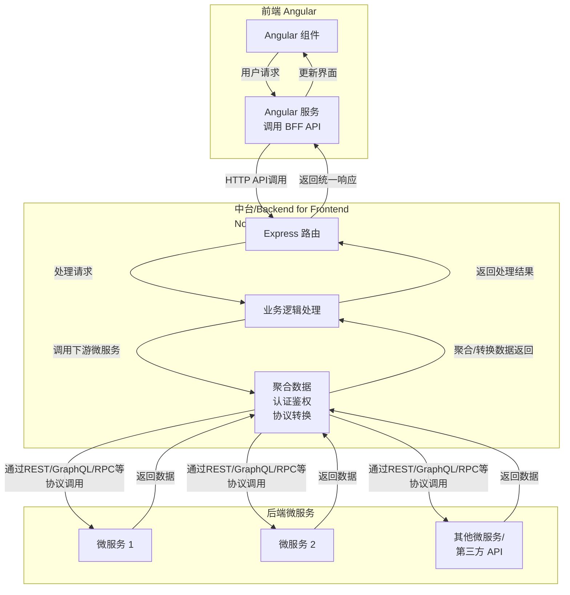

# SaaS 最佳实践

## Angular 结合 Node.js + Express 作为中台（或 BFF）与后端微服务连接，构建 SaaS（软件即服务）应用，是可行且常见的架构选择

🧠 核心架构理解

这种架构通常如下图所示：



其中，中台（BFF） 作为前端与后端微服务间的“中间层”，核心职责包括：

· 聚合数据：将多个微服务的调用聚合为一个，减少前端请求次数。
· 认证鉴权：处理用户身份验证和权限检查。
· 协议转换：将后端微服务的数据格式转换为前端期望的格式。

⚖️ 技术选型的优势与考量

下表对比了使用 Node.js + Express 作为 BFF 的优势和需要注意的方面：

方面 优势 需要注意/考量
技术栈统一 前后端都使用 TypeScript（Angular 和 Node.js），共享类型定义，减少上下文切换，提高开发效率。 需要团队同时熟悉 Angular 和 Node.js/Express。
性能与异步 Node.js 非阻塞 I/O 模型适合 BFF 大量聚合下游微服务的 I/O 密集型操作。 需注意避免阻塞主线程的 CPU 密集型操作。对于复杂业务逻辑，可能需要更结构化的框架（如 NestJS）。
灵活性与生态 Express 灵活、轻量，中间件生态丰富，可快速搭建和迭代 API。 Express 本身不直接提供微服务架构所需的全部基础设施（如服务发现、熔断器），需自行集成或选择更全面的框架（如 NestJS）。
SaaS 多租户 可在 BFF 层统一处理租户隔离、认证和授权，简化前端和微服务的逻辑。 需要精心设计租户标识的传递（如通过 JWT claims）和上下文管理机制。

🛠️ 实践考虑

· BFF 的职责要清晰：BFF 应专注于前端需求的数据聚合和适配，避免承载核心业务逻辑，这些应放在下游微服务中。
· 选择合适的 Node.js 框架：
  · 对于快速起步或简单场景，Express 足够灵活。
  · 对于需要更多开箱即用支持（如依赖注入、模块化、微服务设施集成）的大型复杂项目，可以考虑基于 TypeScript 的 NestJS。NestJS 提供了更结构化的方式来构建应用，包括与微服务模式的良好集成。
· 关注安全性：作为所有前端流量的入口，BFF 是实施安全策略（如速率限制、防注入）、认证和授权的理想位置。
· 性能与监控：BFF 作为关键枢纽，其性能和稳定性至关重要。需关注下游服务调用的并行化（避免串行等待）、错误处理以及完善的日志记录和监控。

💎 总结

Angular (前端) + Node.js/Express (中台 BFF) + 后端微服务，是构建 SaaS 应用时一种合理且强大的技术组合。它尤其能发挥全栈 TypeScript 的优势，并很好地应对复杂前端的数据需求。

只需注意明确 BFF 的职责边界，并根据项目规模和团队情况，在 Express 的轻量和 NestJS 的“全家桶”之间做出合适的选择。

## Node.js、Express.js 和 NestJS 之间的关系和区别

这是一个非常好的问题，也是很多Node.js开发者会遇到的困惑。简单来说，它们的关系和区别可以这样概括：

· Node.js：是一个JavaScript运行时环境，让你可以用JavaScript写服务器端代码。它是基础平台。
· Express.js：是一个运行在Node.js之上的Web应用框架。它提供了一系列极简、灵活的工具和功能（如路由、中间件）来构建Web服务器和API。它是库/框架。
· NestJS：也是一个运行在Node.js之上的Web应用框架。但它不是一个简单的库，而是一个“开箱即用”的、有强烈工程化约束的框架体系。它底层默认使用Express（也可以切换为Fastify），在其之上提供了完整的架构解决方案。

你可以把它们的关系想象成：

· Node.js = 地基和建筑材料（砖、水泥）。
· Express.js = 给你提供了工具（锤子、锯子）和蓝图，让你可以自由地、用任何风格去盖房子（平房、别墅、奇形怪状的房子都行）。
· NestJS = 一个预制了各种标准构件（墙体、楼梯、管线）的“模块化房屋建造系统”。它规定了房子的结构和建造方式，让你能更快、更标准地盖出结构稳固、易于维护的高层建筑。

下面通过一个表格和详细解释来深入对比：

📊 NestJS vs Express.js 核心区别对比

特性 Express.js NestJS
架构哲学 极简、灵活、非约定俗成 (Unopinionated) 完整、结构化、约定俗成 (Opinionated)
架构风格 由开发者自己决定项目结构（MVC, MVP等），自由度极高。 强制采用模块化、分层架构（深受 Angular 启发），默认推崇使用依赖注入 (DI)。
学习曲线 平缓，易于上手。 相对陡峭，需要先理解其核心概念（模块、控制器、服务、注入等）。
语言 纯 JavaScript / TypeScript（但需要自行配置TS环境）。 首选并深度集成 TypeScript，从设计之初就为TS打造，提供了出色的泛型和元数据支持。
开箱即用功能 极少。你需要自行选择和集成各种中间件（如身份验证passport.js、日志morgan、ORMSequelize等）。 极其丰富。集成了依赖注入、模块系统、拦截器、守卫、管道、 GraphQL、WebSocket、微服务支持、日志、配置管理等。
可测试性 可测试，但需要开发者自己搭建测试环境和依赖注入。 为测试而生。依赖注入系统让单元测试和集成测试变得极其简单，可以轻松 mock 依赖。
适用场景 快速开发小型项目、简单的REST API、需要高度自定义架构的特殊项目。 大型复杂企业级应用、需要长期维护和扩展的项目、微服务架构、要求高代码质量和一致性的团队项目。
社区与生态 非常成熟，拥有海量的中间件，是Node.js社区最基础、最广泛使用的框架。 生态快速增长且高质量，提供了大量官方和维护良好的 @nestjs/ 开头的包，与各种技术（TypeORM, Mongoose, GraphQL, RabbitMQ等）集成度很高。

---

🧱 代码风格对比

让我们通过创建一个简单的 “Hello World” API 来直观感受两者的区别。

1. Express.js 示例

```javascript
// app.js
const express = require('express');
const app = express();
const port = 3000;

// 自己定义一个路由和处理函数
app.get('/', (req, res) => {
  res.send('Hello World from Express!');
});

app.listen(port, () => {
  console.log(`Example app listening on port ${port}`);
});
```

特点：非常直接，所有逻辑（路由、业务）都写在一起。对于小项目很方便，但随着项目变大，如果不对代码进行分层，很容易变成“意大利面条式”代码，难以维护。

2. NestJS 示例

NestJS 强制你将应用分解为模块、控制器和服务。

第1步：创建服务 (处理业务逻辑)

```typescript
// app.service.ts
import { Injectable } from '@nestjs/common';

@Injectable() // 装饰器声明这是一个可被注入的类
export class AppService {
  getHello(): string {
    return 'Hello World from NestJS!';
  }
}
```

第2步：创建控制器 (处理HTTP请求/响应)

```typescript
// app.controller.ts
import { Controller, Get } from '@nestjs/common';
import { AppService } from './app.service'; // 引入服务

@Controller() // 装饰器声明这是一个控制器
export class AppController {
  constructor(private readonly appService: AppService) {} // 依赖注入

  @Get() // 装饰器定义路由
  getHello(): string {
    return this.appService.getHello(); // 调用服务中的方法
  }
}
```

第3步：创建根模块 (组装应用)

```typescript
// app.module.ts
import { Module } from '@nestjs/common';
import { AppController } from './app.controller';
import { AppService } from './app.service';

@Module({
  imports: [],
  controllers: [AppController], // 注册控制器
  providers: [AppService], // 注册服务提供者
})
export class AppModule {}
```

第4步：启动入口

```typescript
// main.ts
import { NestFactory } from '@nestjs/core';
import { AppModule } from './app.module';

async function bootstrap() {
  const app = await NestFactory.create(AppModule);
  await app.listen(3000);
}
bootstrap();
```

特点：代码量更多，但结构清晰，职责分明。控制器只负责网络交互，业务逻辑全部交给Service。这种分离使得代码极易测试（你可以轻松Mock AppService 来测试 AppController）和维护。

🎯 如何选择？

· 选择 Express.js 当：
  · 你要构建一个非常简单、小型的应用或API。
  · 你需要极致的灵活性，想完全掌控应用程序的每一层结构。
  · 项目周期短，或者只是做一个原型验证。
· 选择 NestJS 当：
  · 你正在构建一个大型、复杂的企业级应用程序。
  · 你需要与Angular、React等前端框架共享模式和实践（特别是如果你熟悉Angular，NestJS会非常顺手）。
  · 你所在的是一个团队，需要强制执行代码结构和约定以保证质量。
  · 项目需要长期维护和扩展，可测试性和可维护性是首要目标。
  · 你需要快速集成GraphQL、WebSockets、微服务等高级功能。

💎 总结

一言以蔽之，Express.js 是一个灵活的库，而 NestJS 是一个完整的工程解决方案。

NestJS 在 Express 的灵活之上，增加了一套强大的“枷锁”和“工具”，引导（或者说强制）开发者以一种更可维护、更可扩展的方式去构建应用。对于现代大型后端应用开发，NestJS 提供的结构和开箱即用的功能极大地提升了开发效率和项目健壮性。
